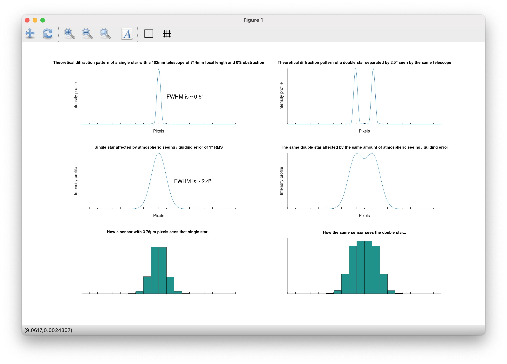
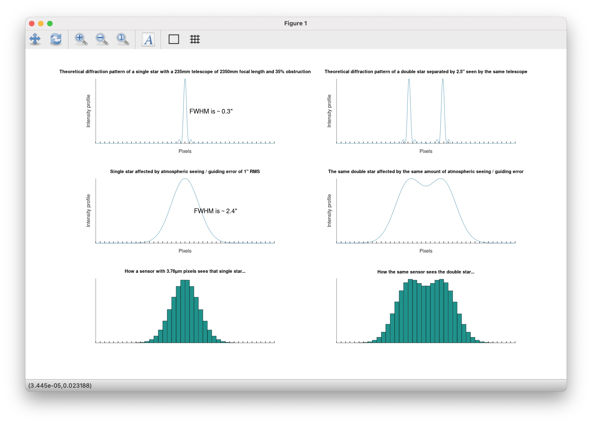

# Astronomical Imaging Resolution Simulator

<!-- toc -->

- [Introduction](#introduction)
- [Setup Steps](#setup-steps)
- [Example Screenshots](#example-screenshots)
  - [Explore Scientific 102mm F/7 with ZWO ASI1600](#explore-scientific-102mm-f7-with-zwo-asi1600)
  - [Celestron 9.25" F/10 with ZWO ASI1600](#celestron-925-f10-with-zwo-asi1600)
- [Important Observations And Comments](#important-observations-and-comments)
- [References](#references)

<!-- tocstop -->

## Introduction

This is a simple simulator written for GNU Octave to demonstrate the effect of aperture, focal length, pixel size, and seeing / guiding accuracy on the ability to resolve small details with common amateur astrophotography equipment. I cover everything you need to know about this tool and how to use it to make better equipment decisions for optimal resolution in deep sky imaging in the following YouTube video:

[](https://www.youtube.com/watch?v=_QPp2mdYcqY)

I quickly put this together in response to James Lamb's video, titled [Optimizing Your Imaging System for Your Guiding Performance](https://www.youtube.com/watch?v=vvJYCM4F8G0), in which he reached a counterintuitive and somewhat controversial conclusion, and since he did not share with his audience the tools he had developed to come to that conclusion, I am afraid that he might have, unintentionally of course, led some of his viewers down the wrong path.

This tool, and the screenshots below, help demonstrate that with an average combined seeing / guiding accuracy of 1.0" (which is average for my location, in California), a Celestron 9.25" used at F/10 (or at F/7), paired with a ZWO ASI1600MM Pro, is a better choice for small targets that demand higher resolution than an Explore Scientific 102mm F/7 refractor, and this is literally the opposite of what James concluded. Although, in fairness to James, I don't know how good or bad the seeing is at his location.

I made this tool available to everyone so that you can run your own simulation and choose the best equipment possible to reach your personal goals. I hope you find it helpful. If you want to contribute, you can open a pull request and I will gladly review it. Or if you want to fork this repository and make the code your own, you can as well. The code has been released under a very permissive license (MIT), so ... knock yourself out! :)

## Setup Steps

Download and install GNU Octave - See [https://www.gnu.org/software/octave/](https://www.gnu.org/software/octave/) for installation instructions for your specific platform. Then, clone this repository, start Octave, and install the necessary packages:

```bash
$ git clone git@github.com:jlecomte/astronomical-imaging-resolution-simulator.git
$ cd astronomical-imaging-resolution-simulator/
$ octave
octave:1> pkg install -forge control
octave:2> pkg install -forge signal
```

For more information on how to install Octave packages, please refer to [this page](https://www.scivision.dev/gnu-octave-install-packages/). On my Mac, I hit a few issues, but a bit of Googling told me that I had to reinstall the Xcode command line tools. Not much I can do for you if this fails, you'll have to figure it out on your own I'm afraid!

In a text editor (I like Visual Studio Code, but any development-oriented editor will do...), open the `simulator.m` file located in this repository. At the top of that file, there are a few variables you can play with, such as the aperture of your telescope, its focal length, the size of its central obstruction, the size of the pixels of your camera, its bit depth, etc. Hopefully, those should be relatively self explanatory.

The most important parameter is `FUZZ_RMS_ARCSEC`, which represents the seeing at your location and your mount's guiding accuracy. To set this value, open an image you've taken with your equipment at your specific location in PixInsight, and measure the FWHM of a few random stars using the `DynamicPSF` process (make sure you pick stars that are nowhere near being saturated!) Then, tweak the value of `FUZZ_RMS_ARCSEC` so that the FWHM of a star affected by seeing or guiding inaccuracies matches what you measured on your own images. The default value matches my equipment (specifically, my mount is an iOptron CEM70) and location (I live in California, where seeing is often fairly decent).

Once you have set all the parameters, save the file and execute it from the Octave prompt:

```
octave:3> simulator
```

It should open a window with a series of graphs that should allow you to understand how your imaging setup will react to seeing or guiding inaccuracies. In particular, it shows you exactly how a close double star would be perceived using your specific imaging setup and with your observing conditions.

## Example Screenshots

Below are two screenshots representing James' equipment, showing that indeed, his Celestron SCT is a better "galaxy scope" than his Explore Scientific 102 refractor (although the latter is a fine scope nonetheless!)

### Explore Scientific 102mm F/7 with ZWO ASI1600



### Celestron 9.25" F/10 with ZWO ASI1600



## Important Observations And Comments

While playing with this tool, I made the following observations:

* Unless you observe from the top of Mauna Kea, or unless your mount is unable to guide accurately, atmospheric seeing is by far the limiting factor, NOT guiding accuracy!
* Given the average seeing conditions in most places where people live (usually, not at the top of a mountain), a 5" to 6" telescope already provides enough raw resolving power! Additionally, with most modern CMOS cameras with tiny pixels, it turns out that a focal length of about 1,000mm is just about the sweet spot. A longer focal length will not bring out any more details, but the SNR will greatly suffer... A larger aperture will reduce the F/ ratio, which is good as long as it does not come with a degradation in image quality.
* Central obstruction has a relatively marginal impact on resolution. I tested a central obstruction of 55% (which is typical of some modern astrographs), and it does not impact the ability to resolve fine details all that much, although it likely has an impact on contrast.

## References

I found the equation to compute the shape of the diffraction pattern with a circular obstruction on Wikipedia [[link](https://en.wikipedia.org/wiki/Airy_disk#Obscured_Airy_pattern)].
